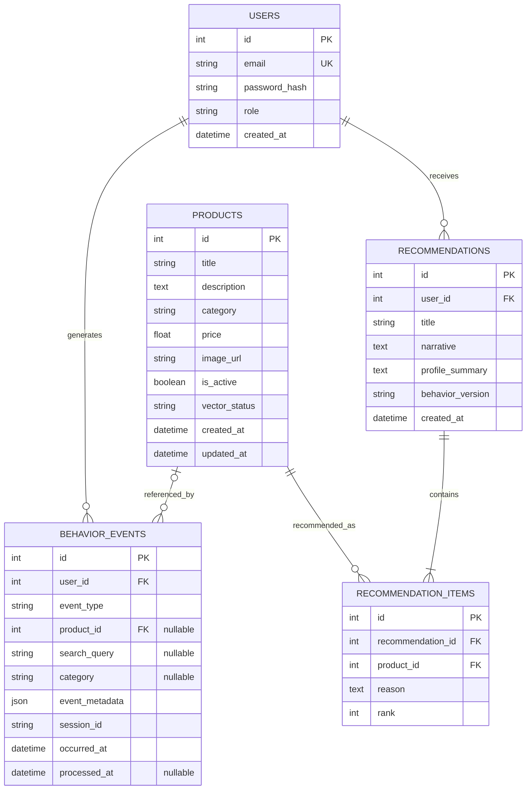

# SmartReco database ER diagram

The diagram covers the application database (`data/smartreco.db`). Chroma's SQLite tables
are internal vector-store implementation details and are intentionally excluded.
