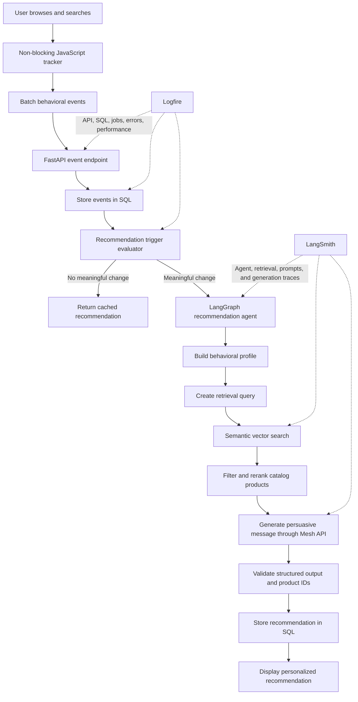

# SmartReco — Product Requirements Document

## 1. Document Purpose

This document is the primary product and implementation reference for the **SmartReco Build Challenge 2026** submission. It defines the required product behavior, architecture, AI workflow, observability strategy, delivery priorities, and acceptance criteria.

## 2. Product Vision

SmartReco is a behavioral AI recommendation platform for an online course or product marketplace. It observes meaningful user activity, develops an evolving understanding of user interests, retrieves relevant products from the real catalog, and generates personalized, persuasive recommendations.

The system must not behave like a static related-products widget. Recommendations must change when user behavior changes and must be grounded in products that exist in the platform catalog.

## 3. Goals

- Capture useful behavioral signals without slowing down the user experience.
- Build an evolving behavioral profile for each user.
- Retrieve relevant products using semantic search and catalog metadata.
- Generate persuasive, personalized recommendation narratives.
- Ensure every recommended product exists in the SQL catalog.
- Avoid unnecessary AI calls through triggers, caching, and cooldowns.
- Keep the SQL database and vector database synchronized.
- Provide application observability through Logfire.
- Provide agent and retrieval observability through LangSmith.
- Route every LLM and AI call through Mesh API.

## 4. Non-Goals

- Training a custom recommendation model.
- Building a full payment or learning-management system.
- Calling an LLM after every user event.
- Returning hardcoded, fabricated, or generic popular-product lists.
- Calling OpenAI, Anthropic, Gemini, or another AI provider directly outside Mesh API.

## 5. User Roles

### Regular User

- Register and sign in with email and password.
- Browse, search, and view products.
- Receive personalized recommendations.
- Interact with recommended products.
- Have recommendations refreshed as behavior changes.

### Administrator

- Sign in with an admin role.
- Create, update, and delete products.
- View product synchronization status.
- Retry or reconcile failed vector synchronization operations.
- Inspect basic operational and recommendation statistics.

## 6. Functional Requirements

### 6.1 Authentication and Authorization

- Support email/password registration and login.
- Store passwords using a secure password hash.
- Support `user` and `admin` roles.
- Restrict product-management operations to administrators.
- Do not record passwords, authorization headers, or session tokens in observability systems.

### 6.2 Product Catalog

Each product should support at least:

- ID
- Title
- Description
- Category
- Price
- Image URL or local image reference
- Availability status
- Creation and update timestamps
- Vector synchronization status

Administrators must be able to create, read, update, and delete products.

### 6.3 SQL and Vector Dual-Write

When a product is created or updated:

1. Validate the product data.
2. Save the canonical product record in SQL.
3. Build a searchable representation from its title, description, category, and relevant metadata.
4. Generate embeddings through Mesh API when an AI embedding call is required.
5. Upsert the vector record using the SQL product ID as its stable identity.
6. Record vector synchronization status in SQL.

When a product is deleted or deactivated, its vector record must also be deleted or made unavailable for retrieval.

Failed synchronization must be visible and retryable. A reconciliation process should periodically identify and repair differences between SQL and the vector database.

### 6.4 Behavioral Event Tracking

The frontend should capture meaningful activity such as:

- Product view
- Product click
- Search query
- Category visit
- Time spent
- Repeat view
- Recommendation impression
- Recommendation click
- Purchase or enrollment, if implemented

Tracking must be efficient and non-blocking:

- Queue events in the browser.
- Send events in batches.
- Throttle high-frequency events.
- Use lightweight asynchronous requests.
- Do not make recommendation generation part of the event-ingestion response path.

Each stored event should include:

- Event ID
- User ID
- Event type
- Product ID when applicable
- Search query or category when applicable
- Metadata
- Event timestamp
- Session ID

### 6.5 Recommendation Triggering

The system must not call AI for every event. A recommendation may be generated when:

- A minimum meaningful-event score is reached.
- The user demonstrates a new search or category interest.
- The dominant behavioral profile changes.
- The recommendation cooldown has expired.
- No equivalent recommendation is cached.
- No recommendation job is already running for the same behavioral version.

Conceptual trigger rule:

```text
generate = meaningful_event_score >= threshold
           AND behavioral_profile_changed
           AND cooldown_expired
           AND no_equivalent_cached_result
           AND no_active_generation_job
```

### 6.6 Agentic Recommendation Engine

The recommendation engine will be implemented as a LangGraph workflow with these nodes:

1. **Load activity** — collect recent and historically important events.
2. **Build behavioral profile** — infer topics, categories, intent, price preferences, and engagement strength.
3. **Decide** — determine whether new retrieval and generation are justified.
4. **Create retrieval query** — convert behavioral evidence into a semantic search request.
5. **Retrieve products** — search the vector database.
6. **Filter and rerank** — apply availability, category, price, and relevance constraints.
7. **Evaluate retrieval** — decide whether the retrieved set is sufficiently relevant.
8. **Refine** — improve the query and retrieve again when quality is weak.
9. **Generate** — use Mesh API to create a short persuasive narrative and structured recommendations.
10. **Validate** — verify all product IDs against the SQL catalog and reject invented products.
11. **Persist** — save the recommendation, behavioral version, evidence, and timestamps.

The generated output should use a structured schema containing:

- Recommendation title
- Persuasive narrative
- Recommended product IDs
- Per-product reason
- Behavioral signals used
- Generation timestamp
- Behavioral-profile version

### 6.7 Recommendation Display

- Show the current recommendation on the user-facing site.
- Clearly display the recommended products and why they fit the user.
- Track recommendation impressions and clicks.
- Continue showing a cached recommendation while a refresh is running.
- Avoid displaying recommendations containing deleted or unavailable products.

### 6.8 Scheduled Proactive Recommendations

APScheduler will periodically:

1. Find active users with meaningful new behavior.
2. Skip users with insufficient behavioral changes.
3. Reuse valid cached recommendations when appropriate.
4. Run the LangGraph workflow for eligible users.
5. Store new recommendations.
6. Optionally send an email digest.
7. Record job execution in Logfire and agent execution in LangSmith.

## 7. End-to-End Flow



## 8. Mesh API Compliance

Every LLM or AI call must pass through Mesh API, including:

- Behavioral-profile summarization
- Retrieval-query generation
- Embedding generation when applicable
- Recommendation narrative generation
- AI-based reranking when applicable
- AI-based recommendation evaluation when applicable

The application will expose a single centralized Mesh client. Other modules must use this client instead of creating direct provider clients.

Configuration must use environment variables, including:

```text
MESH_API_KEY=
MESH_BASE_URL=https://api.meshapi.ai/v1
MESH_CHAT_MODEL=
MESH_EMBEDDING_MODEL=
```

Secrets must never be committed to Git.

## 9. Observability

### 9.1 Logfire: Application Observability

Logfire will monitor:

- FastAPI requests and response latency
- Authentication and authorization failures
- Event batch sizes and ingestion duration
- SQL operations and errors
- Product-vector synchronization
- Cache hits and misses
- Recommendation-trigger decisions
- Background scheduler execution
- Mesh API latency and failures
- Unhandled exceptions

Suggested metrics:

```text
events_ingested_total
event_batch_size
recommendation_triggered_total
recommendation_skipped_total
recommendation_cache_hit_total
recommendation_generation_seconds
vector_sync_failures_total
mesh_request_seconds
recommendation_impressions_total
recommendation_clicks_total
```

### 9.2 LangSmith: Agent Observability

LangSmith will trace:

- Complete LangGraph executions
- Individual agent nodes
- Behavioral-profile inputs
- Retrieval queries
- Retrieved product IDs and similarity scores
- Filtering and refinement decisions
- Mesh prompts and structured responses
- Token and model usage
- Workflow failures
- Recommendation-quality evaluations

LangSmith traces must avoid unnecessary personally identifiable information. Passwords, authentication headers, API keys, and session tokens must never be traced.

### 9.3 Correlation

Where practical, a shared request, job, or recommendation correlation ID should be added to both Logfire events and LangSmith traces. This will make it possible to move from an API failure or slow request in Logfire to the corresponding agent trace in LangSmith.

## 10. Data Model

Minimum expected entities:

- `users`
- `products`
- `behavior_events`
- `behavior_profiles`
- `recommendations`
- `recommendation_items`
- `vector_sync_jobs` or equivalent synchronization state

Important relationships:

- A user has many behavior events.
- A user has one or more versioned behavioral profiles.
- A user has many stored recommendations.
- A recommendation has many recommendation items.
- Each recommendation item references a real SQL product.

## 11. Suggested Technology Stack

- **Backend:** FastAPI
- **ORM:** SQLAlchemy
- **Database:** SQLite for local development, PostgreSQL-ready design
- **Vector database:** Chroma or Qdrant
- **Agent workflow:** LangGraph
- **AI gateway:** Mesh API
- **Application observability:** Logfire
- **Agent observability:** LangSmith
- **Scheduler:** APScheduler
- **Frontend:** Jinja2 and lightweight JavaScript
- **Testing:** Pytest

## 12. Security and Privacy

- Hash passwords using a secure password-hashing library.
- Enforce role-based access for admin operations.
- Store secrets only in environment variables.
- Add `.env` to `.gitignore`.
- Do not log passwords, API keys, cookies, tokens, or authorization headers.
- Minimize personal data in Logfire and LangSmith.
- Validate all request data.
- Protect state-changing browser requests against common web attacks.
- Apply sensible limits to event batch sizes and metadata.

## 13. Testing Requirements

Tests should cover:

- Authentication and role enforcement
- Product CRUD
- SQL/vector synchronization
- Synchronization failure and retry behavior
- Event ingestion and batching contracts
- Recommendation-trigger decisions
- Retrieval against the real vector store abstraction
- Rejection of nonexistent product IDs
- Recommendation persistence
- Cache and cooldown behavior
- Mesh client routing
- Scheduler eligibility rules
- Sensitive-data redaction

At least one integration test should demonstrate the complete path from behavioral events to a stored, catalog-grounded recommendation.

## 14. Acceptance Criteria

The core implementation is complete when:

- A user can register, sign in, browse, and search products.
- An administrator can create, update, and delete products.
- Product mutations synchronize with SQL and the vector database.
- User activity is captured asynchronously and stored correctly.
- Meaningful behavior changes can trigger a background recommendation job.
- The agent retrieves products from the real vector catalog.
- Every returned product ID is validated against SQL.
- The recommendation contains personalized persuasive copy.
- Recommendations are stored and displayed.
- Redundant AI calls are prevented through triggers, caching, and cooldowns.
- Every AI call uses Mesh API.
- Application execution is observable in Logfire.
- Agent execution is observable in LangSmith.
- Secrets and sensitive values are not committed or traced.
- Automated critical checks pass.

## 15. Delivery Priorities

### Phase 1 — Foundation

- FastAPI project structure
- Configuration and secret handling
- SQLAlchemy models
- Authentication and roles
- Product catalog UI

### Phase 2 — Catalog Intelligence

- Vector database integration
- Product dual-write
- Retry and reconciliation handling
- Admin synchronization visibility

### Phase 3 — Behavioral Intelligence

- Frontend event queue
- Batched event-ingestion API
- Behavioral-profile aggregation
- Trigger and cooldown logic

### Phase 4 — Agentic Recommendations

- Central Mesh API client
- LangGraph workflow
- Retrieval, filtering, refinement, and validation
- Recommendation persistence and display

### Phase 5 — Production Readiness

- Logfire instrumentation
- LangSmith tracing
- APScheduler jobs
- Caching
- Tests and error handling

### Phase 6 — Submission

- Complete README
- Architecture diagram
- GitHub Actions workflow
- Repository secrets
- Demo data
- Optional deployment and demo video

## 16. Submission Checklist

- [ ] Public GitHub repository
- [ ] All source code committed
- [ ] Python FastAPI backend
- [ ] `requirements.txt`, `pyproject.toml`, or `Pipfile`
- [ ] Complete `README.md`
- [ ] `.gitignore` includes `.env`
- [ ] No committed secrets
- [ ] `MESH_API_KEY` configured as a GitHub secret
- [ ] `SUBMISSION_TOKEN` configured as a GitHub secret
- [ ] Hackathon workflow saved as `.github/workflows/smartreco-checks.yml`
- [ ] All Python files compile
- [ ] Critical automated checks pass
- [ ] SQL/vector dual-write works
- [ ] Behavioral tracking works
- [ ] Recommendations are catalog-grounded
- [ ] Logfire application traces work
- [ ] LangSmith agent traces work
- [ ] Optional deployed URL prepared
- [ ] Optional demo video prepared

## 17. Success Indicators

The demonstration should make the following clearly visible:

1. A user initially receives no recommendation or a neutral starting state.
2. The user repeatedly explores a particular topic or category.
3. Batched behavioral events appear in the backend.
4. The trigger recognizes a meaningful behavioral change.
5. The agent retrieves relevant real products.
6. A personalized narrative explains why those products fit the user.
7. The stored recommendation changes after the user demonstrates a different interest.
8. Logfire shows the supporting application flow.
9. LangSmith shows the supporting agent and retrieval trace.

This evidence is more valuable than adding many disconnected features because it directly proves that SmartReco watches, understands, retrieves, persuades, and adapts.
