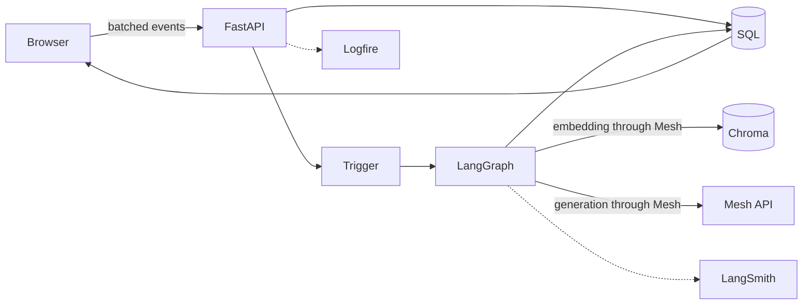

# SmartReco

SmartReco is a behavioral AI recommendation platform built for the SmartReco Build Challenge 2026. It captures meaningful browsing activity, retrieves real catalog products with semantic search, and uses Mesh API to write personalized recommendations that evolve with each user.

## What is implemented

- FastAPI web application with server-rendered UI
- Email/password authentication and user/admin roles
- SQLAlchemy catalog, behavior-event, and recommendation models
- Admin product creation and deactivation
- SQL-to-Chroma product synchronization
- Batched, non-blocking browser event tracking
- Weighted recommendation triggers, cooldowns, and cached results
- Explicit LangGraph recommendation workflow
- Catalog-grounded validation of every recommended product ID
- Mesh API for embeddings and recommendation generation
- Logfire instrumentation for FastAPI, SQLAlchemy, events, and jobs
- LangSmith traces for the graph and Mesh calls
- APScheduler recommendation checks
- Automated linting and tests

The detailed requirements and acceptance criteria live in [PROJECT_PRD.md](PROJECT_PRD.md).

## Architecture



The graph reads activity, builds a profile, performs semantic retrieval, grounds results against active SQL products, generates persuasive copy, validates product IDs, and stores the result.

## Local setup

Python 3.11 or newer is required.

```bash
python -m venv .venv
source .venv/bin/activate        # Windows PowerShell: .venv\Scripts\Activate.ps1
pip install -e ".[dev]"
cp .env.example .env            # Windows PowerShell: Copy-Item .env.example .env
```

Set at least these values in `.env`:

```text
SECRET_KEY=<long-random-value>
MESH_API_KEY=<your-rsk-key>
MESH_CHAT_MODEL=<supported-chat-model>
MESH_EMBEDDING_MODEL=<supported-embedding-model>
```

Optional observability:

```text
LOGFIRE_TOKEN=<project-write-token>
LOGFIRE_SEND_TO_LOGFIRE=true
LANGSMITH_TRACING=true
LANGSMITH_API_KEY=<api-key>
LANGSMITH_PROJECT=smartreco
```

Create the database and sample catalog:

```bash
python -m app.seed
```

The development accounts details are 
admin account is `admin@test.com` with password `admin1234`
user account is `learn@test.com` with password `admin1234`

Change or remove it before deploying publicly.

After configuring `MESH_API_KEY`, open `/admin/products` and select **Retry sync** for each seeded product.

Run the application:

```powershell
.\.venv\Scripts\python.exe -m uvicorn app.main:app --host 127.0.0.1 --port 8010 --reload
```

Open `http://127.0.0.1:8010`.

## Recommendation flow

1. The browser queues product views, searches, clicks, categories, and time-spent events.
2. It sends up to 100 events per request without blocking navigation.
3. FastAPI stores the batch and schedules a trigger check.
4. Weighted events must cross the configured threshold and cooldown.
5. LangGraph builds a behavioral profile.
6. Mesh creates the semantic embedding used to query Chroma.
7. Candidate IDs are loaded from SQL to remove inactive or nonexistent products.
8. Mesh writes a structured narrative using only the grounded candidates.
9. Invalid or invented IDs are rejected.
10. The recommendation and its items are saved and displayed on the home page.

## Observability

Logfire handles application traces: HTTP requests, SQL queries, batched event ingestion, vector synchronization, scheduler execution, latency, and failures. Request arguments are excluded except for validation errors to reduce sensitive-data exposure.

LangSmith handles agent traces. `LANGSMITH_TRACING=true` records the LangGraph nodes and nested Mesh calls in the configured project. Do not include secrets or raw personal data in prompts or trace metadata.

## Tests

```bash
ruff check .
pytest --cov=app --cov-report=term-missing
```

## GitHub submission setup

Add `MESH_API_KEY` and `SUBMISSION_TOKEN` as repository secrets. The organizer-provided workflow intentionally sends these credentials to the organizer API, so it is not committed automatically; review and add it at submission time after explicitly approving that trust boundary.

## Deployment decisions

- SQLite and local Chroma make the demo reproducible. For multi-instance deployment, use PostgreSQL and a shared vector service.
- Background tasks and APScheduler suit this single-process demo. Multiple workers should use a durable task queue.
- Products remain valid SQL records when Mesh is unavailable, but vector status becomes `failed` and can be retried by an admin.
